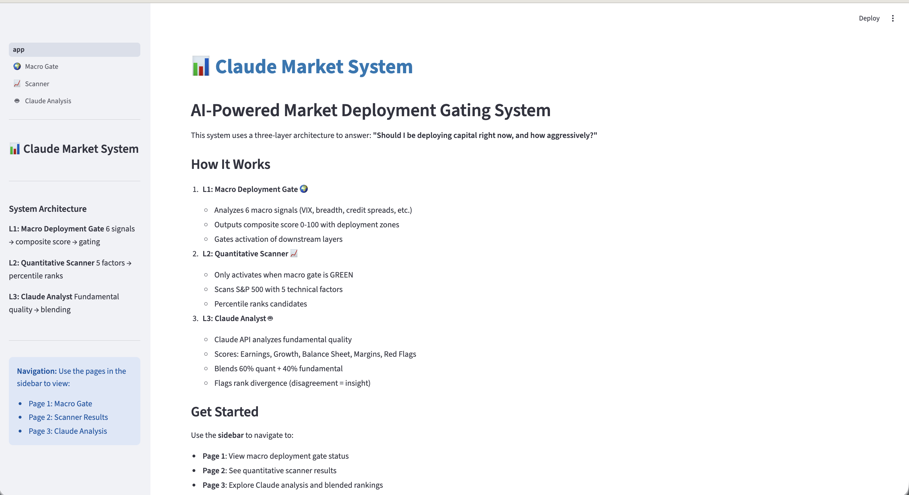
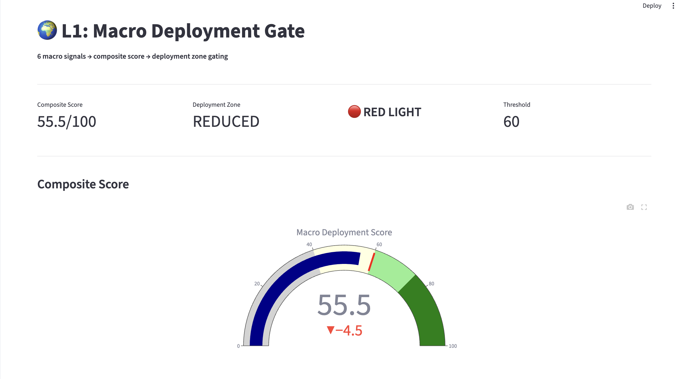
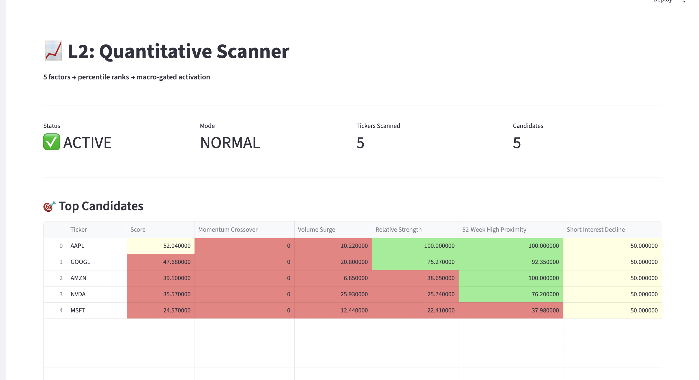
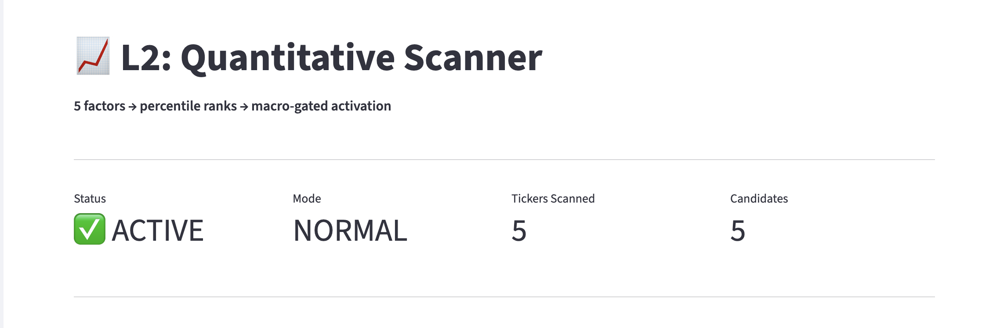

# Claude Market System

[](https://www.python.org/downloads/)
[](https://opensource.org/licenses/MIT)
[](https://streamlit.io)
[](https://www.anthropic.com)

AI-powered market deployment gating system with three-layer analysis architecture. Combines macro signals, quantitative factors, and Claude AI fundamental analysis to answer: **"Should I be deploying capital right now, and how aggressively?"**


*Three-layer gated architecture: Macro → Quant → AI Analysis*

---

## 🎯 Features

- **📊 6 Macro Signals**: VIX analysis, market breadth, credit spreads, sentiment
- **📈 5 Quantitative Factors**: Momentum, volume, relative strength, technical indicators
- **🤖 AI Fundamental Analysis**: Claude API scores earnings quality, growth, balance sheet health
- **💾 Smart Caching**: SQLite + prompt caching minimizes API costs
- **🎨 Interactive Dashboard**: 3-page Streamlit UI with Plotly visualizations
- **⚡ Parallel Processing**: Multi-threaded data fetching for performance
- **🔒 Gated Execution**: Layers only activate when conditions are favorable

---

## 🏗️ System Architecture

```
┌─────────────────────────────────────────────────────────────┐
│ L1: MACRO DEPLOYMENT GATE                                   │
│ 6 signals → composite 0-100 → zone gating                   │
│ Output: DEFENSIVE | REDUCED | NORMAL | AGGRESSIVE           │
└────────────────────────┬────────────────────────────────────┘
                         │ [GREEN LIGHT REQUIRED]
                         ↓
┌─────────────────────────────────────────────────────────────┐
│ L2: QUANTITATIVE SCANNER                                    │
│ 5 factors → percentile ranks → filtered candidates          │
│ Modes: DEFENSIVE (off) | REDUCED (>75) | NORMAL (all)      │
└────────────────────────┬────────────────────────────────────┘
                         │ [MACRO-GATED ACTIVATION]
                         ↓
┌─────────────────────────────────────────────────────────────┐
│ L3: CLAUDE ANALYST                                          │
│ Fundamental quality → 60/40 blend → rank divergence flags   │
│ Cache: SQLite by (ticker, quarter_end)                      │
└─────────────────────────────────────────────────────────────┘
```

---

## 🚀 Quick Start

### Prerequisites

- Python 3.10 or higher
- Anthropic API key ([Get one here](https://console.anthropic.com/))

### Installation

```bash
# Clone the repository
git clone https://github.com/iampankajaswal/claude-market-system.git
cd claude-market-system

# Create virtual environment (optional but recommended)
python -m venv venv
source venv/bin/activate  # On Windows: venv\Scripts\activate

# Install dependencies
pip install -r requirements.txt

# Set up environment variables
cp .env.example .env
# Edit .env and add your ANTHROPIC_API_KEY
```

### Run the System

```bash
# Run full pipeline (L1 → L2 → L3)
python run_analysis.py --scan-and-analyze

# Run individual layers
python run_analysis.py --signals-only    # L1: Macro gate only
python run_analysis.py --scan-only       # L1 + L2: Signals + Scanner
python run_analysis.py --analyze-only    # L3: Claude analysis only

# Launch interactive dashboard
streamlit run dashboard/app.py
```

### Command-Line Options

```bash
# Limit candidates analyzed (cost control)
python run_analysis.py --scan-and-analyze --max-candidates 10

# Scan more stocks
python run_analysis.py --scan-and-analyze --universe-size 200

# Force refresh Claude cache
python run_analysis.py --analyze-only --force-refresh
```

---

## 📸 Dashboard Screenshots

### Page 1: Macro Deployment Gate

*Real-time composite score with 6 macro signals and deployment zone indicator*

### Page 2: Quantitative Scanner

*Top candidates ranked by 5-factor composite scores with radar chart analysis*

### Page 3: Claude Analysis

*AI-powered fundamental scoring with divergence detection and blended rankings*

> **Note**: Add screenshots to `docs/images/` directory and update README

---

## 🧩 Components

### L1: Macro Deployment Gate

**Purpose**: Determine market conditions for capital deployment

**6 Signals** (each scored 0-100):
1. **VIX Level** - Current volatility percentile vs 1-year history
2. **VIX Term Structure** - Contango (calm) vs backwardation (stress)
3. **Market Breadth** - % of S&P 500 above 200-day SMA
4. **Credit Spreads** - HYG vs TLT spread (risk appetite)
5. **Put/Call Sentiment** - VIX 20-day rate of change
6. **Market Momentum** - SPY vs key moving averages

**Output**: 
- Composite score 0-100
- Deployment zone: DEFENSIVE (0-40) | REDUCED (40-60) | NORMAL (60-75) | AGGRESSIVE (75-100)
- Green light threshold for scanner activation

### L2: Quantitative Scanner

**Purpose**: Identify high-potential candidates when macro allows

**5 Factors** (percentile ranked 0-100):
1. **Momentum Crossover** - 10-day EMA vs 50-day EMA + 3-month return
2. **Volume Surge** - 5-day vs 20-day average (institutional accumulation)
3. **Relative Strength** - 20-day return vs SPY benchmark
4. **52-Week High Proximity** - Distance to 52-week high (George & Hwang 2004)
5. **Short Interest Decline** - Bearish position covering (placeholder)

**Features**:
- Scans S&P 500 universe (configurable)
- Parallel processing (10 workers)
- Three operating modes
- Only activates when L1 green light

### L3: Claude Analyst

**Purpose**: Non-deterministic fundamental quality assessment

**Process**:
1. Fetch 4 quarters of financials via yfinance
2. Calculate ratios: CF0/NI, AR vs Revenue Growth, Debt/Equity, ROE, Margins
3. Send to Claude API with senior analyst system prompt
4. Score 5 dimensions (1-10): Earnings Quality, Growth, Balance Sheet, Margins, Red Flags
5. Blend: **60% quantitative + 40% Claude fundamental**
6. Flag rank divergence ≥ 3 positions (disagreement = opportunity)

**Technology**:
- Anthropic Claude Sonnet 4.5
- SQLite cache by (ticker, quarter_end)
- Prompt caching for cost efficiency
- Batch processing with cache-hit tracking

---

## 📁 Project Structure

```
claude-market-system/
├── signals/                      # L1: Macro deployment gate
│   ├── __init__.py
│   ├── vix_level.py             # VIX percentile analysis
│   ├── vix_term_structure.py    # Term structure analysis
│   ├── breadth.py               # Market breadth calculation
│   ├── credit_spreads.py        # HYG/TLT spread proxy
│   ├── put_call.py              # VIX rate of change
│   ├── market_momentum.py       # SPY trend strength
│   └── run_signals.py           # Orchestrator
│
├── scanner/                      # L2: Quantitative scanner
│   ├── __init__.py
│   ├── factors/
│   │   ├── __init__.py
│   │   ├── momentum.py          # EMA crossover
│   │   ├── volume.py            # Volume surge
│   │   ├── relative_strength.py # RS vs SPY
│   │   ├── high_proximity.py    # 52-week high
│   │   └── short_interest.py    # Short covering
│   └── run_scanner.py           # Scanner orchestrator
│
├── analyst/                      # L3: Claude fundamental analysis
│   ├── __init__.py
│   ├── cache.py                 # SQLite caching layer
│   ├── financials.py            # Financial data & ratios
│   ├── analyzer.py              # Claude API integration
│   ├── blender.py               # Score blending logic
│   └── run_analysis.py          # Analysis orchestrator
│
├── dashboard/                    # Streamlit UI
│   ├── app.py                   # Main dashboard
│   └── pages/
│       ├── 1_🌍_Macro_Gate.py   # L1 visualization
│       ├── 2_📈_Scanner.py       # L2 results
│       └── 3_🤖_Claude_Analysis.py # L3 analysis
│
├── data/                         # Data storage
│   ├── cache.db                 # SQLite cache (gitignored)
│   └── results/                 # JSON outputs (gitignored)
│
├── run_analysis.py              # Main CLI orchestrator
├── requirements.txt             # Python dependencies
├── .env.example                 # Environment template
├── .gitignore
└── README.md
```

---

## 🎨 Dashboard

The Streamlit dashboard provides interactive visualization of all three layers:

### Launch Dashboard

```bash
streamlit run dashboard/app.py
```

Access at: `http://localhost:8501`

### Pages

1. **🌍 Macro Gate**: Composite score gauge, signal breakdown, zone indicators
2. **📈 Scanner**: Top candidates table, factor analysis, radar charts, score distribution
3. **🤖 Claude Analysis**: Blended rankings, divergence flags, quant vs AI scatter plot, detailed fundamental analysis

---

## 🔑 Key Design Principles

### 1. Gated Activation
Scanner only runs when macro gate gives green light. No half-measures.

### 2. Percentile Ranking
All scores relative to universe, not absolute thresholds. Adapts to market conditions.

### 3. Divergence = Insight
Where quantitative signals and AI analysis disagree is where the most interesting opportunities lie.

### 4. Cache-First Architecture
- SQLite cache by (ticker, quarter_end)
- Claude API prompt caching
- Same quarter = free repeat analysis

### 5. Parallel Processing
Multi-threaded data fetching for scanning 100+ stocks efficiently.

### 6. Production-Ready
Error handling, logging, configurability, cost controls.

---

## ⚙️ Configuration

### Environment Variables

Create a `.env` file (or set environment variables):

```bash
# Required for L3
ANTHROPIC_API_KEY=sk-ant-api03-...

# Scanner configuration
SCANNER_MODE=REDUCED              # REDUCED (>75) | DEFENSIVE (disabled)
MIN_COMPOSITE_SCORE=60            # Macro gate threshold (0-100)

# Optional settings
CACHE_EXPIRY_DAYS=1              # SQLite cache expiry
LOOKBACK_PERIODS=252             # Trading days for historical data
FUNDAMENTAL_WEIGHT=0.40          # Claude weight in blend (0.0-1.0)
DIVERGENCE_THRESHOLD=3           # Rank delta to flag disagreement
```

### Operating Modes

**DEFENSIVE**: Scanner disabled, no new positions  
**REDUCED**: Scanner active, only surface candidates scoring >75  
**NORMAL**: Scanner active, show all candidates (with green macro gate)

---

## 🔬 Data Sources

- **Market Data**: [yfinance](https://github.com/ranaroussi/yfinance) - OHLCV, fundamentals, financial statements
- **VIX Data**: Yahoo Finance (^VIX, ^VIX3M)
- **Credit Spreads**: HYG (high yield bonds), TLT (treasuries) ETF prices
- **Universe**: S&P 500 constituents (default 100 stocks, configurable)
- **AI Analysis**: [Anthropic Claude API](https://www.anthropic.com/api) (Sonnet 4.5)

---

## 📊 Example Output

```bash
$ python run_analysis.py --scan-and-analyze

CLAUDE MARKET SYSTEM - Full Pipeline
================================================================================

🔄 Running L1: Macro Deployment Gate...
✓ VIX Level: 61.35/100
✓ VIX Term Structure: 100.00/100
✓ Market Breadth: 42.50/100
✓ Credit Spreads: 55.20/100
✓ Put/Call Sentiment: 71.66/100
✓ Market Momentum: 100.00/100

COMPOSITE SCORE: 71.79/100
DEPLOYMENT ZONE: NORMAL
GREEN LIGHT: 🟢 YES

🔄 Running L2: Quantitative Scanner...
Scanning 100 tickers...
✓ Scanned 100 tickers

NORMAL mode: 23 candidates

🔄 Running L3: Claude Analyst...
Analyzing 20 candidates with Claude API...
  Analyzing AAPL (1/20)...
    ✓ Claude score: 82.5/100
  Analyzing MSFT (2/20)...
    ✓ Cache hit
...

BLENDED RANKINGS (60% Quant + 40% Claude)
Rank Ticker Blended  Quant Claude ΔRank        Flag
   1   AAPL   74.32  68.50  82.50    +5  🟢 UPGRADE
   2   NVDA   71.85  78.20  62.50    -3  🔴 DOWNGRADE
   3   MSFT   68.90  65.40  74.00    +2  ⚪ ALIGNED

Divergence Summary:
  🟢 Upgrades (Claude more bullish): 8
  🔴 Downgrades (Claude more bearish): 5

✅ PIPELINE COMPLETE
```

---

## 🧪 Testing

```bash
# Test individual components
python signals/run_signals.py          # Test L1
python scanner/demo_scanner.py         # Test L2 (5 stocks)
python analyst/test_financials.py      # Test L3 data gathering

# Test with limited scope (cost control)
python run_analysis.py --scan-and-analyze --max-candidates 5 --universe-size 10
```

---

## 💰 Cost Considerations

### Claude API Usage

- **Prompt Caching**: System prompt cached (~1,500 tokens)
- **Per Analysis**: ~500-800 tokens input, ~300-500 tokens output
- **Cache Hits**: Near-zero cost for repeat quarter analysis
- **Estimated**: ~$0.01-0.02 per new ticker analysis with Sonnet 4.5

### Cost Controls

1. `--max-candidates` flag limits analysis count
2. SQLite cache prevents redundant API calls
3. Prompt caching reduces system prompt costs to near-zero
4. Same quarter = free from cache

**Example**: Analyzing 20 stocks with 50% cache hit rate ≈ $0.10-0.20

---

## 🛠️ Development

### Adding a New Signal (L1)

1. Create `signals/new_signal.py` with `calculate_new_signal_score()` function
2. Add import to `signals/run_signals.py`
3. Add to `signal_functions` list in `run_macro_gate()`

### Adding a New Factor (L2)

1. Create `scanner/factors/new_factor.py` with `calculate_new_factor_score()` function
2. Add import to `scanner/run_scanner.py`
3. Add factor calculation in `scan_ticker()` function

### Customizing Claude Prompt (L3)

Edit `analyst/analyzer.py` → `ANALYST_SYSTEM_PROMPT` constant

---

## 🤝 Contributing

Contributions are welcome! Please:

1. Fork the repository
2. Create a feature branch (`git checkout -b feature/amazing-feature`)
3. Commit your changes (`git commit -m 'Add amazing feature'`)
4. Push to the branch (`git push origin feature/amazing-feature`)
5. Open a Pull Request

---

## 📝 License

This project is licensed under the MIT License - see the [LICENSE](LICENSE) file for details.

---

## 🙏 Acknowledgments

- **[Anthropic](https://www.anthropic.com)** for Claude API
- **[yfinance](https://github.com/ranaroussi/yfinance)** for market data
- **[Streamlit](https://streamlit.io)** for dashboard framework
- **George & Hwang (2004)** for 52-week high proximity research

---

## 📧 Contact

**Pankaj Aswal** - [@iampankajaswal](https://github.com/iampankajaswal)

Project Link: [https://github.com/iampankajaswal/claude-market-system](https://github.com/iampankajaswal/claude-market-system)

---

## ⚠️ Disclaimer

This software is for educational and research purposes only. It is not financial advice and should not be used as the sole basis for investment decisions. Always conduct your own research and consult with qualified financial advisors before making investment decisions. Past performance does not guarantee future results.

---

<div align="center">

**Built with [Claude Code](https://claude.ai/code) | Powered by [Anthropic Claude API](https://www.anthropic.com/api)**

⭐ Star this repo if you find it useful!

</div>
